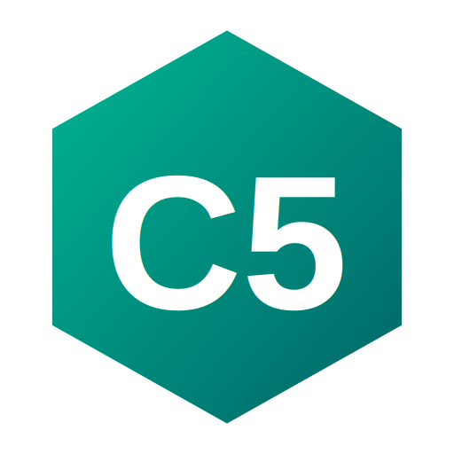

# C5 Programming Language

<div align="center">
  
</div>

C5 is a high-performance, statically-typed programming language that compiles directly to x86_64 GAS (GNU Assembler). It is designed to be lightweight, memory-aware, and seamlessly compatible with the C ABI.

> [!NOTE]
> C5 is a **non-serious** programming language created with the assistance of AI. It was developed to allow its creator to write C-like programs more easily while maintaining fine-grained control over the language's behavior. It is **not intended for commercial use**. However, if you would like to use it for your own projects or contribute to its development, you are more than welcome to do so!

## 🚀 Key Features

- **Direct x86_64 GAS Compilation**: No heavy IR, just pure, readable assembly.
- **Strict C ABI Compatibility**: Call any C library function with zero overhead.
- **Automatic Namespacing**: Included headers (like `std.c5h`) are partitioned into namespaces to avoid symbol clobbering.
- **Smart String Handling**: Native support for string concatenation (`+`) and substring removal (`-`).
- **Pointer Arithmetic**: Full support for raw memory manipulation with automatic type scaling.
- **Modern CLI**: Compile to executables with `-o` or inspect assembly with `-S`.

## 🛠️ Getting Started

### Installation
```bash
# Clone the repository and install in editable mode
pip install -e .
```

### Basic Usage
```bash
# Compile and link to create an executable
c5c main.c5 -o my_app

# Add custom include paths
c5c main.c5 -I ./custom_headers -o my_app

# Setup global libraries (~/.c5/include)
c5c --setup-libs

# Compile and output only assembly
c5c main.c5 -S -o output.s

# Compile as a static library
c5c mylib.c5 --lib static -o mylib

# Compile as a dynamic/shared library
c5c mylib.c5 --lib dynamic -o mylib
```

## 📚 Library System

C5 supports creating and linking libraries seamlessly. Libraries allow you to package reusable code and distribute it as pre-compiled binaries.

### Creating a Library

1. **Write your library code** in a `.c5` file with the functions you want to expose:

```c5
// mylib.c5
int<32> add(int<32> a, int<32> b) {
    return a + b;
}

int<32> multiply(int<32> a, int<32> b) {
    return a * b;
}
```

2. **Create a header file** (`.c5h`) that declares the library's public interface:

```c5
// mylib.c5h
libinclude <mylib.a> #static

int<32> add(int<32> a, int<32> b);
int<32> multiply(int<32> a, int<32> b);
```

The `libinclude` directive tells the compiler which library file to link. The optional `#static` or `#dynamic` specifier indicates the library type (if omitted, the compiler infers from the file extension).

3. **Compile the library**:

```bash
# Static library (.a)
c5c mylib.c5 --lib static -o mylib

# Dynamic/shared library (.so)
c5c mylib.c5 --lib dynamic -o mylib
```

This produces `mylib.a` (static) or `mylib.so` (shared).

### Using a Library

In your application, simply include the header:

```c5
include <mylib.c5h>

void main() {
    int<32> result = add(10, 20);
    std::printf("%d\n", result);
}
```

Then compile normally:

```bash
c5c main.c5 -o myapp
```

The compiler automatically:
- Finds the header file (using the standard include search paths)
- Extracts the library path from `libinclude`
- Links the library into your executable

### Library Search Paths

When resolving `libinclude` paths, the compiler searches relative to the header file's directory. You can also use:

- **Relative paths**: `libinclude <../libs/mylib.a>`
- **Absolute paths**: `libinclude </usr/local/lib/mylib.a>`

### Distribution

To distribute your library:
1. Provide the header file (`.c5h`) for compilation
2. Provide the compiled library (`.a` or `.so`)
3. Users include the header and link against the library

The `libinclude` directive in the header ensures the correct library is automatically linked.

---

## 🏗️ Build System

C5 includes a simple build system using `.c5b` files to automate the compilation process for larger projects.

### Using the `--build` flag

You can build a project by pointing the compiler to a `.c5b` file or a directory containing a `build.c5b` file:

```bash
# Build using a specific build file
c5c --build myproject.c5b

# Build using the build.c5b file in the current directory
c5c --build .

# Build a project in a subfolder
c5c --build path/to/project
```

### Build File Format (`.c5b`)

The build file uses a simple key-value format. Below are the available configuration options:

#### For Programs
```c5b
type: "program"
files:
    "main.c5"
    "utils.c5"

outfolder: "bin/"
outname: "my_app"
```

#### For Libraries
```c5b
type: "library"
libtype: "static" // Options: static, dynamic
files:
    "math.c5"

h_files:
    "math.c5h"

outfolder: "lib/"
outname: "math"
install: "ask" // Options: ask, force, no
```

### Configuration Options

| Key | Description |
| :--- | :--- |
| `type` | Project type: `"program"` or `"library"`. |
| `libtype` | (Library only) Type of library: `"static"` (.a) or `"dynamic"` (.so). |
| `files` | List of source files to compile. |
| `h_files` | (Library only) List of header files to install. |
| `outfolder` | Target directory for build artifacts. |
| `outname` | Name of the output file (without extension). |
| `install` | (Library only) Installation behavior: `"ask"`, `"force"`, or `"no"`. |
| `noutfolder` | If `1`, the output folder itself won't be copied during installation. |

---

## 📂 Include Search Order
When you use `include <file.c5h>`, the compiler searches in this order:
1. Current directory of the source file.
2. Custom paths provided via `-I`.
3. Project-local `c5include/` directory.
4. Global `~/.c5/include/` directory (populated via `c5c --setup-libs`).

---

## 🎨 Syntax Highlighting

C5 comes with syntax highlighting support for popular editors.

### Emacs

The `syntax_highlight/c5-mode.el` file provides a major mode for C5.

**Installation:**

1. Copy `c5-mode.el` to your Emacs load path (e.g., `~/.emacs.d/lisp/`):
   ```bash
   mkdir -p ~/.emacs.d/lisp
   cp syntax_highlight/c5-mode.el ~/.emacs.d/lisp/
   ```

2. Add the following to your `~/.emacs` or `~/.emacs.d/init.el`:
   ```elisp
   ;; Add C5 mode to load path
   (add-to-list 'load-path "~/.emacs.d/lisp")
   
   ;; Require c5-mode
   (require 'c5-mode)
   
   ;; Associate .c5 and .c5h files with c5-mode
   (add-to-list 'auto-mode-alist '("\\.c5\\'" . c5-mode))
   (add-to-list 'auto-mode-alist '("\\.c5h\\'" . c5-mode))
   ```

3. Reload your configuration or restart Emacs.

**Features:**
- Syntax highlighting for keywords, types, built-in functions, strings, comments, and numbers
- Support for C-style comments (`//` and `/* */`)
- Automatic file association for `.c5` and `.c5h` files
- Highlighting for built-in methods (`.push()`, `.insert()`, etc.)
- Support for `#namespaces` directive
- Basic indentation support

### Neovim / Vim

The `syntax_highlight/c5.vim` file provides syntax highlighting for C5.

**Installation:**

1. Copy `c5.vim` to your Vim runtime directory:
   ```bash
   # For Neovim (recommended)
   mkdir -p ~/.config/nvim/syntax
   cp syntax_highlight/c5.vim ~/.config/nvim/syntax/
   
   # For Vim
   mkdir -p ~/.vim/syntax
   cp syntax_highlight/c5.vim ~/.vim/syntax/
   ```

2. Create or edit your `~/.config/nvim/filetype.vim` (or `~/.vim/filetype.vim`) to detect C5 files:
   ```vim
   augroup filetypedetect
     autocmd BufNewFile,BufRead *.c5 set filetype=c5
     autocmd BufNewFile,BufRead *.c5h set filetype=c5
   augroup END
   ```

3. Reload Vim/Neovim or run `:filetype detect`.

**Features:**
- Full syntax highlighting for C5 language constructs
- Support for parameterized types (`int<32>`, `float<64>`)
- Highlighting for namespace resolution (`::`) and arrow operator (`->`)
- Macro and preprocessor directive highlighting (e.g., `#namespaces`)
- Highlighting for built-in methods (`.length()`, `.insert()`, etc.)
- Comment and string highlighting with escape sequences

---

## 📖 Language Documentation

### 1. Basic Types
C5 uses explicit bit-widths for its types to ensure predictability across platforms.

| Type | Description | Alias of |
| :--- | :--- | :--- |
| `int` | 64-bit signed integer | `int<64>` |
| `int<32>` | 32-bit signed integer | - |
| `int<16>` | 16-bit signed integer | - |
| `int<8>` | 8-bit signed integer (byte) | - |
| `char` | 8-bit character | `int<8>` |
| `float` | 64-bit floating point | `float<64>` |
| `float<32>` | 32-bit floating point | - |
| `string` | UTF-8 encoded string | - |
| `void` | Empty return type | - |

### 2. Signed and Unsigned Modifiers
C5 supports `signed` and `unsigned` modifiers for integer types to explicitly specify the sign behavior:

```c
include <std.c5h>

unsigned int<32> get_positive() {
    return 4294967295;  // Maximum unsigned 32-bit value
}

void main() {
    unsigned int<32> a = get_positive();
    signed char b = 'b';
    
    // Unsigned types use zero-extension
    // Signed types use sign-extension
    std::printf("%u | %c\n", a, b);
}
```

| Modifier | Behavior |
| :--- | :--- |
| `signed` | Explicitly marks type as signed (sign-extension on load) |
| `unsigned` | Marks type as unsigned (zero-extension on load) |

**Key differences:**
- **Signed types**: Use sign-extension when loading smaller values (e.g., `movsbq`, `movswq`, `movslq`)
- **Unsigned types**: Use zero-extension when loading smaller values (e.g., `movzbq`, `movzwq`, `movl`)
- By default, `int`, `int<8>`, `int<16>`, `int<32>`, `int<64>`, and `char` are signed unless explicitly marked `unsigned`

### 3. Variables & Constants
```c
int<32> age = 25;
string name = "Jose";
float pi = 3.14159;
char initial = 'J';
```

#### Nested Assignments
C5 supports nested assignments, allowing you to assign a value to multiple variables in a single statement. The assignment expression returns the assigned value, which can then be used as the right-hand side of another assignment.

```c
int a;
int b;
int c;
a = b = c = 100; // All variables are now 100
```

Nested assignments also work with structs and other aggregate types:

```c
Point p1;
Point p2;
p1 = p2 = {10, 20};
```

#### Aggregate Reassignment
You can reassign values to existing struct or array variables using initializer lists. This is particularly useful inside loops:

```c
Point p = {0, 0};
while (condition) {
    p = {new_x, new_y}; // Direct reassignment using initializer list
}
```

This is supported for both `struct` types and `array<T>` types.

#### Constants
Use the `const` keyword to declare variables that cannot be modified after initialization. Constants can be declared at both global and local scope:

```c
include <std.c5h>

// Global constant
let const int<32> MAX_VALUE = 100;

void main() {
    // Local constant
    const int<32> local_const = 42;
    
    std::printf("MAX_VALUE = %d\n", MAX_VALUE);
    std::printf("local_const = %d\n", local_const);
    
    // Error: cannot modify a const variable
    // local_const = 50;  // E042: Const Violation
}
```

**Key features:**
- **Immutable**: Once initialized, const variables cannot be assigned new values
- **Type-safe**: Const correctness is enforced at compile time
- **Global and local**: Use `let const` for globals, `const` for locals
- **Error E042**: Attempting to modify a const variable produces error E042

**Const with different types:**
```c
const string GREETING = "Hello";
const float<32> PI = 3.14159;
const char NEWLINE = '\n';
```

### 4. Control Flow
C5 supports standard C control structures:
- `if` / `else`
- `while` loops
- `do` / `while` loops
- `for` loops
- `foreach` loops (for iterating over arrays)

```c
for (int i = 0; i < 10; i = i + 1) {
    if (i == 5) {
        std::printf("Halfway there!\n");
    }
}
```

#### Foreach Loops
The `foreach` loop provides a convenient way to iterate over arrays with both index and value:

```c
include <std.c5h>

void main() {
    array<int<32>> arr = {10, 20, 30, 40, 50};

    foreach (i, val in arr) {
        std::printf("arr[%d] = %d\n", i, val);
    }
}
```

**Syntax:** `foreach (index_var, value_var in array_expr) { body }`

- `index_var`: A variable that holds the current index (0-based)
- `value_var`: A variable that holds the current element value
- `array_expr`: An array expression (can be a variable or function return)

The `foreach` loop automatically:
- Determines the element type from the array
- Iterates from index 0 to length-1
- Provides both the index and value in each iteration

#### With Statements
The `with` statement evaluates an expression and binds it to a name, which is only available within the statement's block. This is useful for managing scope and avoiding variable name pollution.

```c
include <std.c5h>

void main() {
    with (10 + 20 as int<32> result) {
        std::printf("Result: %d\n", result);
    }
    // 'result' is not available here
}
```

**Syntax:** `with (expression as type name) { body }`

- `expression`: The expression to evaluate
- `type`: The explicit type for the bound variable
- `name`: The name of the variable to bind the expression result to
- `body`: The block of code where the variable is available

#### Switch-Case Statements

The `switch` statement allows multi-way branching based on an integer or enum expression:

```c
include <std.c5h>

enum Color { RED, GREEN, BLUE };

void main() {
    Color color = Color::RED;

    switch (color) {
        case Color::RED:
            std::printf("Red\\n");
            break;
        case Color::GREEN:
            std::printf("Green\\n");
            break;
        case Color::BLUE:
            std::printf("Blue\\n");
            break;
        default:
            std::printf("Unknown color\\n");
            break;
    }
}
```

**Syntax:**
```
switch (expression) {
case constant_expression:
    statements
case constant_expression:
    statements
default:
    statements
}
```

- The `switch` expression must be of integer or enum type.
- Each `case` label must be followed by a constant expression (integer literal, char, or enum constant).
- The `default` case is optional and executes if no other case matches.
- `break` statements are used to exit the switch early. Without `break`, execution falls through to the next case.

#### Break Statement

The `break` statement terminates the execution of the innermost enclosing loop (`for`, `while`, `do-while`, `foreach`) or `switch` statement. It transfers control to the statement immediately following the loop or switch.

```c
for (int i = 0; i < 10; i = i + 1) {
    if (i == 5) {
        break;  // Exit the loop when i reaches 5
    }
}
```

**Note:** `break` is only allowed inside loops or a switch. Using `break` elsewhere will cause a compile-time error.

#### Compound Assignment Operators

C5 supports compound assignment operators that combine an arithmetic, bitwise, or shift operation with assignment:

- `+=` (addition assignment)
- `-=` (subtraction assignment)
- `*=` (multiplication assignment)
- `/=` (division assignment)
- `%=` (modulo assignment)
- `&=` (bitwise AND assignment)
- `|=` (bitwise OR assignment)
- `^=` (bitwise XOR assignment)
- `<<=` (left shift assignment)
- `>>=` (right shift assignment)

These operators modify the variable in place by performing the operation and storing the result back into the left-hand operand.

Example:

```c
include <std.c5h>

void main() {
    int<32> a = 10;
    a += 5;   // a is now 15
    a *= 2;   // a is now 30
    a >>= 2;  // a is now 7
    std::printf("a = %d\n", a);
}
```

#### Increment and Decrement Operators

C5 supports prefix and postfix increment (`++`) and decrement (`--`) operators:

- `++a` (prefix increment): increments `a` and returns the new value.
- `a++` (postfix increment): returns the old value of `a`, then increments it.
- `--a` (prefix decrement): decrements `a` and returns the new value.
- `a--` (postfix decrement): returns the old value of `a`, then decrements it.

These operators work on integer types and pointers. For pointers, increment/decrement adjusts by the size of the pointed-to type.

Example:

```c
include <std.c5h>

void main() {
    int<32> x = 10;
    int<32> y = ++x;  // x = 11, y = 11
    int<32> z = x++;  // z = 11, x = 12
    std::printf("x=%d, y=%d, z=%d\n", x, y, z);
}
```

### 5. Directives & Namespacing
When you `include <std.c5h>`, all functions inside are placed in the `std::` namespace.
```c
include <std.c5h>

void main() {
    std::printf("Hello, C5!\n");
}
```

#### Deactivating Namespaces
You can deactivate automatic namespacing for subsequent includes using the `#namespaces` directive. This is useful if you want to use symbols from a library directly without a prefix.

```c
#namespaces 0;
include <std.c5h>

void main() {
    printf("Hello, C5!\n"); // No std:: prefix needed
}
```
The directive is stateful; use `#namespaces 1;` to re-enable namespacing for further includes.

### 6. String Power
Strings in C5 are more than just pointers; they support arithmetic and built-in methods.
```c
string s = "Hello";
s = s + " World";   // Concatenation
s = s - " Hello";   // Result: " World"
int len = s.length(); // Get length (6)
string replaced = s.replace("World", "Everyone"); // Replace substring
```

#### String Replacement
The `.replace(old, new)` method creates a new string with all occurrences of `old` replaced by `new`:

```c
include <std.c5h>

void main() {
    string str = "hello, world!";
    string new_str = str.replace("world", "everyone");
    std::printf("%s\n", new_str);  // Outputs: "hello, everyone!"
}
```

- **`.replace(old, new)`**: Returns a new string with all occurrences of `old` replaced by `new`
- The original string is not modified (immutable operation)
- Both `old` and `new` must be string expressions

#### C String Interoperability
C5 provides seamless interoperability with C strings through the built-in `c_str()` function and string indexing:

```c
include <std.c5h>

void main() {
    // Convert a C5 string to a C string (char*)
    char* a = c_str("Hello, world!");
    
    // Index into C strings
    char b = a[1];  // 'e'
    std::printf("str: %s\nchar: %c\n", a, b);
    
    // Index into C5 strings directly
    string a2 = "Hello, world!";
    char b2 = a2[1];  // 'e'
    std::printf("str: %s\nchar: %c\n", a2, b2);

    // Use .length() on both types
    int len1 = a.length();
    int len2 = a2.length();
}
```

**Key features:**
- `c_str(string)`: Converts a C5 `string` to a C `char*` pointer for use with C library functions
- `[]` operator: Works on both `string` and `char*` types to access individual characters
- `.length()` method: Returns the string length (available for both `string` and `char*`)
- Returns `char` type when indexing into strings

### 7. Structs & Enums
```c
struct Point {
    int<32> x;
    int<32> y;
};

enum Color { RED, GREEN, BLUE };

void main() {
    Point p = {10, 20};
    int<32> my_color = Color::RED;
}
```

### 8. Arrow Operator
When accessing struct members through a pointer, use the `->` operator:
```c
include <std.c5h>

struct Point {
    int<32> x;
    int<32> y;
};

void main() {
    Point pt = {0, 0};
    Point* ptr = &pt;

    ptr->x = 42;
    ptr->y = 99;

    std::printf("x = %d\n", ptr->x);
    std::printf("y = %d\n", ptr->y);
}
```

### 9. Arrays
C5 provides a dynamic `array<T>` type with built-in methods for managing collections:
```c
include <std.c5h>

void main() {
    // Create an array with initial values
    array<int<32>> arr = {1, 2, 3, 4, 5};

    // Access elements by index
    std::printf("arr[0]: %d\n", arr[0]);

    // Push a new element to the end
    arr.push(6);

    // Insert an element at a specific index
    arr.insert(0, 0); // Insert 0 at index 0

    // Insert multiple items at a specific index
    arr.insertItems(2, {10, 20, 30});

    // Pop and return the last element
    int<32> last = arr.pop();

    // Get the length
    int<64> len = arr.length();

    // Clear all elements
    arr.clear();
}
```

Arrays can also be passed to and returned from functions:
```c
array<int<32>> append_value(array<int<32>> arr) {
    arr.push(arr[arr.length() - 1] + 1);
    return arr;
}
```

### 10. C-Style Fixed-Size Arrays
C5 supports C-style fixed-size arrays with stack allocation and compile-time size checking. These arrays are declared with the syntax `type name[size]` and can be initialized with initializer lists or string literals (for char arrays).

#### Syntax and Declaration

```c
include <std.c5h>

void main() {
    // Fixed-size integer array with initializer list
    int<32> intlist[4] = {1, 2, 3, 4};
    
    // Char array (C string) initialized with string literal
    char cstr[100] = "hello";
    
    // Zero-initialized array (no initializer)
    double values[10];
}
```

**Key characteristics:**
- **Stack allocation**: Fixed-size arrays are allocated on the stack (unless global).
- **Compile-time size**: The size must be a constant integer literal.
- **Type encoding**: The array size is part of the type (e.g., `int[4]`).
- **No length tracking**: Unlike `array<T>`, fixed-size arrays do not store their length; you must track it manually.
- **Element access**: Use the `[]` operator to access elements by index.
- **Bounds checking**: The compiler does **not** insert automatic bounds checks; out-of-bounds access leads to undefined behavior (may cause runtime exceptions via memory protection).

#### Initialization

Fixed-size arrays support several initialization forms:

**Initializer lists:**
```c
int<32> nums[5] = {10, 20, 30};  // First 3 elements set, rest zero-initialized
char str[20] = "hello";          // String literal copies bytes including null terminator
```

**Zero initialization:**
```c
int<32> buffer[256];  // All elements are automatically zero-initialized
```

For arrays with fewer initializer elements than the array size, the remaining elements are zero-initialized.

#### Access and Assignment

Array elements are accessed using the subscript operator `[]`:

```c
include <std.c5h>

void main() {
    int<32> data[5] = {1, 2, 3, 4, 5};
    
    // Read an element
    int<32> first = data[0];
    std::printf("First: %d\n", first);
    
    // Write an element
    data[2] = 42;
    data[4] = data[1] + data[3];
}
```

**Important notes:**
- The array name **decays** to a pointer to its first element in most expressions (e.g., when passed to functions).
- Unlike `array<T>`, fixed-size arrays do not have methods like `push`, `pop`, or `length`. The size is fixed and must be managed manually.
- When used as a function parameter, a fixed-size array `T[N]` is adjusted to `T*` (pointer to element type).

#### Multi-Dimensional Arrays

Fixed-size arrays can be nested to create multi-dimensional arrays:

```c
include <std.c5h>

void main() {
    // 2D integer matrix (3 rows, 4 columns)
    int<32> matrix[3][4] = {
        {1, 2, 3, 4},
        {5, 6, 7, 8},
        {9, 10, 11, 12}
    };
    
    // Access element at row 1, column 2
    int<32> val = matrix[1][2];  // 7
    
    // 3D array
    double cube[2][3][4];
}
```

Multi-dimensional arrays are stored in row-major order. The total size is the product of all dimension sizes multiplied by the element size.

#### Interaction with Pointers

Fixed-size arrays work seamlessly with pointers:

```c
include <std.c5h>

void main() {
    int<32> arr[5] = {10, 20, 30, 40, 50};
    int<32>* ptr = arr;  // Array decays to pointer to first element
    
    // Pointer arithmetic
    ptr = ptr + 2;       // Points to arr[2]
    std::printf("%d\n", *ptr);  // 30
}
```

You can also use the address-of operator `&` to get a pointer to an array element or the whole array:

```c
int<32>* p1 = &arr[0];    // Pointer to first element
int<32>* p2 = arr;        // Equivalent (array decays)
```

#### Global Fixed-Size Arrays

Fixed-size arrays can be declared at global scope with `let`:

```c
let char greeting[20] = "Hello, world!";
let int<32> lookup_table[256] = {0};

void main() {
    std::printf("%s\n", greeting);
}
```

Global arrays are stored in the `.data` section and are zero-initialized if no initializer is provided.

#### Comparison with `array<T>`

| Feature | Fixed-size `T[N]` | Dynamic `array<T>` |
| :--- | :--- | :--- |
| **Allocation** | Stack (or global data segment) | Heap |
| **Size** | Fixed at compile time | Dynamic, can grow/shrink |
| **Length tracking** | No (manual) | Yes (`length()` method) |
| **Methods** | None (raw array) | `push`, `pop`, `clear`, `length`, `insert`, `insertItems` |
| **Memory layout** | Contiguous block | Header (ptr, len, cap) + heap data |
| **Use case** | Small, known-size collections | Dynamic collections that change size |
| **Performance** | No overhead, direct access | Some overhead for bounds checks and resizing |

#### Type Representation

The type of a fixed-size array is represented internally as a string like `"int[4]"` or `"char[100]"`. The element type and count are encoded in the type string.

**Example type introspection in code generation:**
- `sizeof("int[4]")` returns `4 * sizeof(int)` = 32 bytes (on 64-bit: 4 * 8 = 32).
- The element type is extracted by stripping the brackets: `"int[4]"` → `"int"`.

#### Limitations and Security Concerns

- **No bounds checking**: Accessing `arr[index]` with `index >= size` or `index < 0` is undefined. The compiler does not insert runtime checks.
- **No resizing**: Once declared, the array size cannot be changed.
- **No copy semantics**: Assigning one array to another (`a = b`) is not allowed because arrays are not assignable. Use `memcpy` or element-wise copy.
- **Cannot be returned by value**: Functions cannot return a fixed-size array type directly. Return a pointer or use `array<T>` instead.
- **Size must be constant**: The array size must be an integer literal; variables or expressions are not allowed.

#### Passing to Functions

When a fixed-size array is passed as a function parameter, it automatically decays to a pointer to its element type:

```c
void process(int<32>* data, int<32> count) {
    for (int<32> i = 0; i < count; i = i + 1) {
        data[i] = data[i] * 2;
    }
}

void main() {
    int<32> nums[5] = {1, 2, 3, 4, 5};
    process(nums, 5);  // nums decays to int<32>*
}
```

You can also explicitly use pointer types in the parameter declaration to make the intent clear.

---

### 11. Matrix Support
C5 supports multi-dimensional arrays (matrices) of any type, including structs, enums, unions, and even other arrays. Matrices are represented as nested `array<array<T>>` types and can be nested to any depth.

```c
include <std.c5h>

struct Point {
    float x;
    float y;
};

void main() {
    // 1. Deeply nested float matrix
    array<array<array<float<32>>>> fmatrix;
    fmatrix.push({{1.4, 2.8, 9.2}, {3.9, 2.3, 0.4}, {1.0, 2.0, 3.0}});
    fmatrix.push({{1.0, 0.0, 0.0}, {0.0, 1.0, 0.0}, {0.0, 0.0, 1.0}});

    // 2. Array of structs (struct matrix)
    array<array<Point>> pmatrix;
    pmatrix.push({{1.0, 2.0}, {3.0, 4.0}});
    pmatrix.push({{5.0, 6.0}, {7.0, 8.0}});

    // Iterating over a 3D matrix
    foreach (i, item in fmatrix) {
        foreach (j, row in item) {
            foreach (k, val in row) {
                std::printf("fmatrix[%d][%d][%d] = %.2f\n", i, j, k, val);
            }
        }
    }
}
```

**Key Features:**
- **Recursive Type Support**: Matrices can be nested to any depth (e.g., `array<array<array<int>>>`).
- **Deep Initializer Lists**: Deeply nested matrices can be initialized directly using nested initializer lists.
- **Heap Allocation**: Like regular arrays, matrices manage their memory on the heap.
- **Full Type Compatibility**: Supports matrices of any C5 type, including nested aggregates.

### 12. Pointers & Memory
C5 provides full access to memory with C-like syntax.
```c
include <std.c5h>

void main() {
    int<32> val = 42;
    int<32>* ptr = &val;       // Address-of
    *ptr = 100;                // Dereference
    
    // Pointer arithmetic (automatically scales by sizeof(int<32>))
    int<32>* arr = std::malloc(10 * 4);
    *(arr + 1) = 50; 
    std::free(arr);
}
```

### 13. Public Variables (Globals)
Use the `let` keyword at the top level to declare global variables.
```c
let int<32> counter = 0;

void main() {
    counter = counter + 1;
    std::printf("Counter: %d\n", counter);
}
```

### 14. Macros
C5 supports simple macros that are expanded at compile time. Macros are defined using the `macro` keyword and work like inline functions.

```c
include <std.c5h>

// Define a macro that adds two values
macro add(a, b) {
    a + b
}

void main() {
    int<32> result = add(10, 20);
    std::printf("Sum: %d\n", result);  // Output: Sum: 30
}
```

**Key features of C5 macros:**
- **Parameter substitution**: Macro parameters are replaced with the actual arguments
- **Expression bodies**: The last expression in the macro body becomes the result
- **Zero overhead**: Macros are expanded at compile time, no runtime cost
- **Type flexibility**: Macros work with any compatible types

### 15. Lambda Expressions
C5 supports lambda expressions (anonymous functions) that can be assigned to variables and called like regular functions.

```c
include <std.c5h>

void main() {
    // Define a lambda that adds two integers
    int<32> sum = fnct(int<32> a, int<32> b) {
        return a + b;
    };

    // Call the lambda
    std::printf("%d\n", sum(10, 20));  // Output: 30
}
```

**Lambda syntax:**
```
fnct(parameters) { body }
```

**Key features:**
- **Anonymous functions**: Lambdas are unnamed functions that can be defined inline
- **First-class values**: Lambdas can be assigned to variables and passed around
- **Type inference**: The return type is inferred from the body
- **Closures**: Lambdas capture their surrounding scope

**Example with multiple lambdas:**
```c
include <std.c5h>

void main() {
    int<32> add = fnct(int<32> a, int<32> b) {
        return a + b;
    };
    
    int<32> mul = fnct(int<32> a, int<32> b) {
        return a * b;
    };
    
    std::printf("Add: %d\n", add(5, 3));   // Output: Add: 8
    std::printf("Mul: %d\n", mul(5, 3));   // Output: Mul: 15
}
```

### 16. Type Definitions

C5 supports user-defined type aliases and union-like types using the `type` keyword. This allows you to create a new type that can hold values of any of the specified underlying types.

#### Basic Type Alias

You can define a new name for an existing type:

```c
type MyInt {
    int<32>
};
```

This creates a type `MyInt` that is functionally equivalent to `int<32>`.

#### Union Types

More powerfully, you can define a type that can hold multiple different types, similar to a union:

```c
type Value {
    int<64>,
    float<64>,
    string
};
```

The `Value` type can store an integer, a floating-point number, or a string. The size of the union is the size of its largest member (plus any alignment padding).

**Key characteristics:**
- **Memory Layout**: The union allocates enough memory to hold its largest member. All members share the same memory location.
- **Type Safety**: The compiler allows assignment of any member type to a union variable, and allows a union to be assigned to any of its member types (with explicit cast).
- **No Active Tag**: C5 unions are "untagged" - the language does not track which member is currently active. It is the programmer's responsibility to keep track and use the correct type when accessing the value.

#### Union Casting and Type Access

To access a specific member of a union, you must explicitly cast the union variable to the desired member type:

```c
include <std.c5h>

type Value {
    int,
    float,
    string
};

void main() {
    Value v;
    
    // Store an integer
    v = 10;
    
    // Read as integer (requires cast)
    int i = (int)v;
    std::printf("i = %d\n", i);
    
    // Store a float
    v = 3.14;
    
    // Read as float (requires cast)
    float f = (float)v;
    std::printf("f = %f\n", f);
    
    // Store a string
    v = "hello";
    
    // Read as string (requires cast)
    string s = (string)v;
    std::printf("s = %s\n", s);
}
```

**Important:** When passing a union to a function (including variadic functions like `printf`), you must cast it to the expected type to ensure correct register usage and interpretation:

```c
Value v = 42;
std::printf("Value: %d\n", (int)v);  // Cast to int for %d

v = 3.14;
std::printf("Value: %f\n", (float)v);  // Cast to float for %f
```

#### Unions in Arrays and Structs

Unions can be used as element types in arrays and as fields in structs, enabling flexible data structures:

```c
include <std.c5h>

type Value {
    int,
    float,
    string
};

void main() {
    // Array of unions
    array<Value> values;
    values.push(10);
    values.push(3.14);
    values.push("hello");
    
    // Iterate and cast each element appropriately
    foreach (i, val in values) {
        // Determine which type to use based on index (example)
        if (i == 0) {
            std::printf("int: %d\n", (int)val);
        } else if (i == 1) {
            std::printf("float: %f\n", (float)val);
        } else {
            std::printf("string: %s\n", (string)val);
        }
    }
    
    // Pop and cast
    Value v = values.pop();
    string s = (string)v;
    std::printf("Popped string: %s\n", s);
}
```

Unions can also be nested inside structs:

```c
struct Container {
    Value data;
    int<32> count;
};

void main() {
    Container c;
    c.data = 100;
    c.count = 1;
    
    // Access union field with cast
    int<32> x = (int)c.data;
    std::printf("x = %d\n", x);
}
```

#### Function Parameters and Returns

Unions can be passed as function arguments and returned from functions. The same casting rules apply when you need to treat the union as a specific member type:

```c
type Value {
    int,
    float
};

Value get_value(Value v) {
    return v;  // Union-to-union assignment is allowed
}

void main() {
    Value v = 10;
    Value result = get_value(v);
    
    // Cast to extract the integer
    int i = (int)result;
    std::printf("Result: %d\n", i);
}
```

**Note on Calling Conventions**: Unions are passed by value (copied) when used as function arguments or return values. For unions of size ≤ 8 bytes, the value is passed in integer registers (`%rax`, `%rdi`, etc.). For larger unions, a pointer to a copy is passed instead.

#### Using Type Definitions

Once defined, a type can be used like any other type:

```c
include <std.c5h>

type bool {
    int<1>
};

void main() {
    bool flag = 1;
    std::printf("Flag: %d\n", flag);
}
```

Type definitions are global and must be declared before use. They are stored in the global type namespace, separate from variables and functions.

#### Notes

- **Full Type Checking Support**: The language now enforces strict type checking for assignments to both union types and type aliases. Any assigned value must be compatible with at least one of the underlying types.
- **Computed Sizes**: The size of a union type is automatically computed as the maximum size of its members.
- **Recursive Members**: You can include struct and enum types as members of a union by using their names (e.g., `Point` if a struct `Point` is defined).

### 17. Sizeof Operator

C5 provides the `sizeof` operator to query the size of a type or an expression at compile time. The operator has two forms:

#### sizeof(type)

Returns the size in bytes of a type. The type must be a valid C5 type (built-in, struct, union, or array).

```c
include <std.c5h>

void main() {
    int<32> x;
    std::printf("sizeof(int<32>) = %d\n", sizeof(int<32>));  // 4
    std::printf("sizeof(char) = %d\n", sizeof(char));        // 1
    std::printf("sizeof(float<64>) = %d\n", sizeof(float)); // 8
}
```

#### sizeof(expression)

Returns the size in bytes of the type of the given expression. The expression is analyzed at compile time and its resulting type determines the size.

```c
include <std.c5h>

struct Point {
    int<32> x;
    int<32> y;
};

void main() {
    Point p = {1, 2};
    int<32> arr[10];
    
    std::printf("sizeof(p) = %d\n", sizeof(p));     // 8 (two int<32>)
    std::printf("sizeof(arr) = %d\n", sizeof(arr)); // 40 (10 * sizeof(int<32>))
}
```

**Important:** When `sizeof` is applied to an expression, any variables or identifiers within that expression are considered "used" for dead code analysis. This prevents false warnings about variables that appear unused but are actually referenced in `sizeof`:

```c
void main() {
    int<32> value = 42;
    std::printf("Size: %d\n", sizeof(value));  // 'value' is marked as used, no warning
}
```

Without this behavior, the analyzer would incorrectly warn that `value` is dead code because it only appears in `sizeof`.

**Note:** `sizeof` is evaluated entirely at compile time and does not generate any runtime code to compute the size. The size is embedded as an immediate constant in the generated assembly.

---
### 18. Exception Handling

C5 supports exception handling through `try-catch` blocks, allowing you to handle runtime errors gracefully.

#### Syntax

```c
try {
    // Code that may throw an exception
} catch (e) {
    // Handler code; e contains the error message
}
```

- The `try` block contains code that might generate an exception.
- The `catch` block catches any exception thrown in the `try` block.
- The catch parameter `e` receives the error message as a `string`.

#### Example

```c
include <std.c5h>

void main() {
    try {
        int<1> a = 5;
    } catch (e) {
        std::printf("Error: %s\n", e);
        std::exit(1);
    }
}
```

**Key features:**
- Exceptions are thrown automatically when certain runtime errors occur (e.g., division by zero, out-of-bounds array access).
- The exception message is passed as a `string` to the `catch` block.
- Use `std::exit()` or `return` to terminate the program or continue execution after handling the error.

---

### 19. Type Width Checking

C5 performs compile-time checks to ensure that integer and floating-point literals fit within the specified bit width of the target type.

#### Integer Width Checking

When assigning an integer literal to a variable with a specific integer width (e.g., `int<8>`, `unsigned int<16>`), the compiler verifies that the value lies within the representable range. If the value is too large or too small, an error is raised (E023).

```c
include <std.c5h>

void main() {
    int<8> x = 300;  // Error: value 300 exceeds int<8> range (-128..127)
    unsigned int<8> y = 256;  // Error: value 256 exceeds unsigned int<8> range (0..255)
}
```

The ranges are calculated based on the signedness and bit width:
- Signed `int<N>`: -(2^(N-1)) to 2^(N-1)-1
- Unsigned `int<N>`: 0 to 2^N - 1

#### Floating-Point Width Checking

Similarly, assigning a 64-bit float literal to a `float<32>` variable triggers a warning (W006) because it may lose precision. The language defaults to `float` as 64-bit.

```c
float<32> a = 3.14;  // Warning: possible data loss from float64 to float32
float<64> b = 3.14;  // OK
```

These checks help prevent accidental overflow and data loss.

---

### 20. Operators

C5 supports a comprehensive set of operators for arithmetic, bitwise, logical, and comparison operations. All operators follow C-like precedence and associativity.

#### Arithmetic Operators
- `+` (addition)
- `-` (subtraction)
- `*` (multiplication)
- `/` (integer division)
- `%` (modulo)

#### Bitwise Operators
- `&` (bitwise AND)
- `|` (bitwise OR)
- `^` (bitwise XOR)
- `~` (bitwise NOT, unary)
- `<<` (left shift)
- `>>` (right shift, sign-extended for signed types, zero-extended for unsigned)

#### Logical Operators
- `&&` (logical AND, short-circuit)
- `||` (logical OR, short-circuit)
- `!` (logical NOT, unary)

#### Comparison Operators
- `==` (equal)
- `!=` (not equal)
- `<` (less than)
- `>` (greater than)
- `<=` (less than or equal)
- `>=` (greater than or equal)

#### Other Operators
- `=` (assignment)
- `&` (address-of, unary)
- `*` (dereference, unary)
- `+` (unary plus)
- `-` (unary minus)

**Operator Precedence** (from highest to lowest):

1. Unary (`!`, `~`, `+`, `-`, `*`, `&`)
2. Multiplicative (`*`, `/`, `%`)
3. Additive (`+`, `-`)
4. Shift (`<<`, `>>`)
5. Relational (`<`, `>`, `<=`, `>=`)
6. Equality (`==`, `!=`)
7. Bitwise AND (`&`)
8. Bitwise XOR (`^`)
9. Bitwise OR (`|`)
10. Logical AND (`&&`)
11. Logical OR (`||`)
12. Assignment (`=`)

**Notes:**
- Logical operators `&&` and `||` perform short-circuit evaluation.
- Bitwise shift operators use the lower 5 bits of the right operand (mod 32 for 32-bit types, mod 64 for 64-bit) for the shift count.
- The `~` operator performs bitwise complement.
- The `!` operator returns `1` for non-zero values and `0` for zero.

#### Example

```c
include <std.c5h>

void main() {
    int<32> a = 5;
    int<32> b = 3;
    int<32> c = a & b;      // Bitwise AND: 5 & 3 = 1
    int<32> d = a | b;      // Bitwise OR: 5 | 3 = 7
    int<32> e = a ^ b;      // Bitwise XOR: 5 ^ 3 = 6
    int<32> f = a << 2;     // Left shift: 5 << 2 = 20
    int<32> g = ~a;         // Bitwise NOT: ~5 = -6 (two's complement)
    
    bool cond1 = (a > 0) && (b > 0);  // Logical AND: true
    bool cond2 = (a == 0) || (b == 0); // Logical OR: false
    bool cond3 = !a;                   // Logical NOT: false
    
    std::printf("%d %d %d %d %d | %d %d %d\\n", c, d, e, f, g, cond1, cond2, cond3);
}
```

### 21. Type Conversions (Casts)

C5 supports explicit type conversions (casts) using the syntax `(target_type) expression`. Casts allow you to convert a value from one type to another, overriding the compiler's default type checking.

#### Syntax

```c
(target_type) expression
```

The `target_type` must be a valid type name (built-in or user-defined). The expression is evaluated and converted to the specified type.

#### Supported Conversions

C5 supports a wide range of type conversions:

- **Numeric conversions**: Between integer types (`int`, `char`, `int<N>`) and floating-point types (`float`, `float<32>`, `float<64>`). Implicit conversions follow standard rules (sign-extension, zero-extension, truncation, floating-point rounding).
- **Integer to integer**: Converting between different integer sizes preserves the numeric value when possible; narrowing conversions may truncate.
- **Float to integer**: Truncates toward zero (e.g., `3.7` becomes `3`). Out-of-range values yield implementation-defined results.
- **Integer to float**: Rounds to the nearest representable floating-point value.
- **Float to float**: Converts between `float<32>` and `float<64>` with appropriate precision changes.
- **Character and string conversions**:
  - `char` to `string`: Creates a new string containing the single character.
  - `string` (or `char*`) to `char`: Extracts the first character of the string.
- **Pointer and integer conversions**: Pointers (e.g., `int*`) and integer types can be cast to each other. The pointer size is 8 bytes; integer values are extended or truncated as needed.

Casts to and from user-defined types (structs, enums, union types) are also allowed, but the semantics may be limited. For structs, the cast is treated as a reinterpretation of the underlying bits (similar to `memcpy`), but the size must match.

#### Examples

```c
include <std.c5h>

void main() {
    // Integer to float
    float<32> a = (float<32>)3 / 2;   // 3 is converted to float<32> before division
    
    // Char to string
    string b = (string)'a';           // creates string "a"
    
    // String to char
    char c = (char)b;                 // takes first character 'a'
    
    // Float to integer
    int<32> d = (int<32>)a;           // truncates float to integer
    
    // Pointer to integer
    int<32>* ptr = ...;
    unsigned int<64> addr = (unsigned int<64>)ptr;
    
    // Integer to pointer
    int<32>* ptr2 = (int<32>*)0x1234; // caution: only for low-level programming
    
    std::printf("%.2f\n%s\n%c\n%d\n", a, b, c, d);
}
```

#### Notes

- Casts can bypass type safety and may lead to undefined behavior if used incorrectly (e.g., casting a pointer to an integer of insufficient size).
- The compiler will still perform some checks (e.g., ensuring the target type is known).
- For narrowing conversions (e.g., `int<64>` to `int<8>`), the value is truncated according to the target type's signedness.

### 22. Syscall Built-in

C5 provides a built-in `syscall` function to perform direct system calls on x86_64 Linux.

**Syntax:**
```c
int result = syscall(num_args, rax_value, arg1, arg2, ..., argN);
```

- `num_args`: The number of registers to use for arguments after `rax` (0 to 6). This must be a constant integer literal.
- `rax_value`: The syscall number (placed in `%rax`).
- `arg1` to `argN`: The arguments for the syscall (placed in `%rdi`, `%rsi`, `%rdx`, `%r10`, `%r8`, `%r9` respectively).

**Example:**
```c
include <std.c5h>

void main() {
    // Syscall 1 is 'write'
    // args: 3 (num registers), 1 (rax), 1 (rdi: stdout), "Hello\n" (rsi: buf), 6 (rdx: count)
    syscall(3, 1, 1, "Hello\n", 6);
}
```

---

## 📚 Library Creation

C5 supports creating and using libraries through a combination of header files (`.c5h`) and implementation files (`.c5`).

### Library Structure

A typical C5 library consists of two files:

1. **Header file (`.c5h`)**: Contains function declarations (prototypes).
2. **Implementation file (`.c5`)**: Contains the actual function definitions.

### Include Guards (detect once;)

To prevent a header file from being included multiple times (which can cause redeclaration errors), use the `detect once;` directive at the very top of your `.c5h` file:

```c
detect once;

// Your declarations here...
```

This is functionally equivalent to `#pragma once` in C/C++.

#### Example: Math Library

**math.c5h** (header file):
```c
// Function declarations for the math library
int<32> add(int<32> a, int<32> b);
int<32> sub(int<32> a, int<32> b);
int<32> mul(int<32> a, int<32> b);
int<32> div(int<32> a, int<32> b);
```

**math.c5** (implementation file):
```c
int<32> add(int<32> a, int<32> b) {
    return a + b;
}

int<32> sub(int<32> a, int<32> b) {
    return a - b;
}

int<32> mul(int<32> a, int<32> b) {
    return a * b;
}

int<32> div(int<32> a, int<32> b) {
    return a / b;
}
```

### Using Libraries

To use a library in your C5 project:

**main.c5**:
```c
include <std.c5h>
include <math.c5h>  // Include the library header

void main() {
    int<32> a = 10;
    int<32> b = 20;

    // Call library functions using the namespace (derived from filename)
    int<32> result = math::add(a, b);
    
    std::printf("Result: %d\n", result);
}
```

### Compiling with Libraries

When compiling a project that uses local libraries, pass both the main file and the library implementation file(s) to the compiler:

```bash
# Compile main.c5 with math.c5 library
c5c main.c5 math.c5 -o myapp

# Multiple libraries can be included
c5c main.c5 math.c5 utils.c5 -o myapp
```

### Creating Reusable Object Libraries

You can also compile library implementation files into object files (`.o`) for later linking:

```bash
# Compile math.c5 to an library file (no main function required)
c5c math.c5 --lib dynamic/static -o math.o

# Later, link with your main program
gcc main.o math.o -o myapp
```

### Library Namespacing

When you include a header file (e.g., `include <math.c5h>`), all functions declared in that header are automatically placed in a namespace derived from the filename:

- `math.c5h` → `math::` namespace
- `utils.c5h` → `utils::` namespace
- `std.c5h` → `std::` namespace

This prevents symbol collisions between different libraries. If you prefer not to use namespaces, you can use the `#namespaces 0;` directive before an `include` to import symbols into the global scope. See [Directives & Namespacing](#5-directives--namespacing) for details.

### Best Practices

1. **One library per header/implementation pair**: Keep related functions together
2. **Consistent naming**: Use the same base name for `.c5h` and `.c5` files
3. **Document your API**: Add comments in the header file describing each function
4. **Type consistency**: Ensure declarations in `.c5h` match definitions in `.c5`

---

## 📜 License
This project is licensed under the [MIT License](LICENSE).
